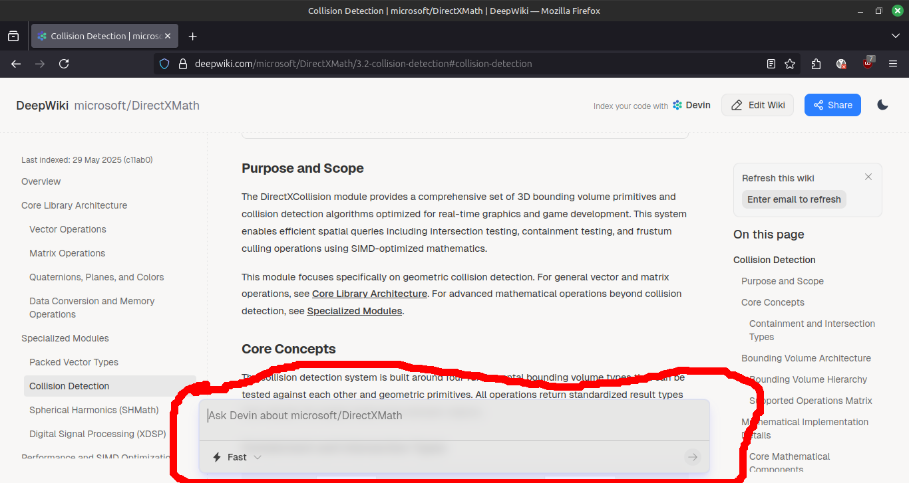

# Design Fails

or: design stuff i think should be changed, by example

## Uncloseable and Obstructive Box
Screenshot taken on 2025-10-23.  
Source URL: https://deepwiki.com/microsoft/DirectXMath/3.2-collision-detection#collision-detection  
  
Image description: A screenshot of the DirectXMath documentation, with an AI ask box on the bottom covering up a vertical area of about 5 lines of text in the main section of the website, without any way to close or hide it.
