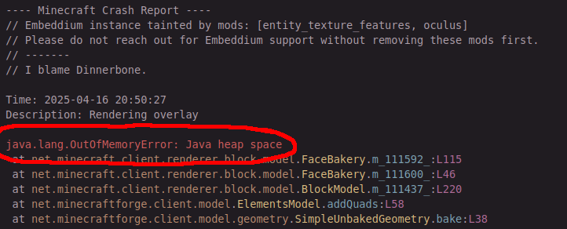
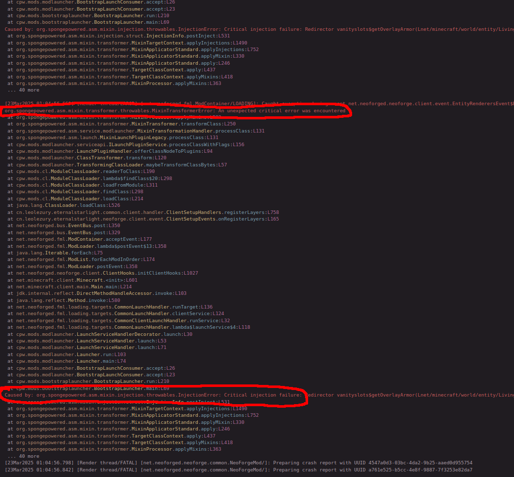
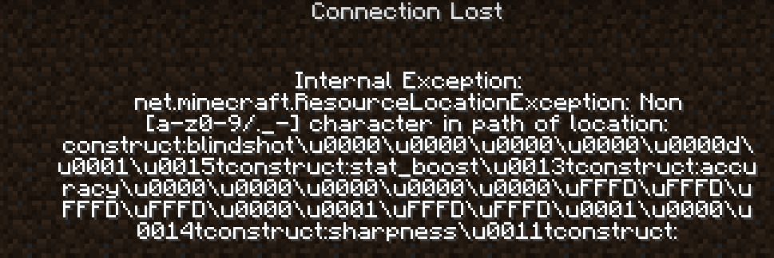

Modded Minecraft Crash Database
===============================

This file will contain a bunch of error messages from modded minecraft crashes, with the intent that you can use your browsers search function to quickly search for your problem.
(As such some headings have multiple exception messages directly below it, so your browsers search function can find them)

Most of the stuff i write about here is stuff i found in logs people asked for help with on the [Modded Minecraft Discord](https://discord.gg/moddedmc).
If you need more help than this guide can provide, i can only recommend asking over there.

IMPORTANT: before changing stuff in a world you played on, DO A BACKUP. You might loose all progress in your world otherwise. And like a friend of mine told me:
> No backup, no mercy.

## Useful links
Firstly, here are some links for more info or help:

- [Modded Minecraft Usual Suspects](usual-suspects.md) (my own list on mods/datapacks to suspect first if anything acts up)
- [Crash Assistant](https://modrinth.com/mod/crash-assistant) (mod that can help you with reading and sharing logs) [Alternative Curseforge link](https://www.curseforge.com/minecraft/mc-mods/crash-assistant)
- [MultiMc FAQ](https://github.com/MultiMC/Launcher/wiki/FAQ) (useful for basic trubleshooting like having the wrong java version)
- [superpowers04's recommendations & co](https://github.com/superpowers04/superpowers04/wiki/mc-info) (What mods to use, what mods/"launchers"/... to avoid)
- [Modded Minecraft Discord](https://discord.gg/moddedmc) and the [r/feedthebeast](https://www.reddit.com/r/feedthebeast/) subreddit it is affiliated with. (good for asking for help with your problems)
- [My own link collection](../where-do-i-find) (a lot of discords, and some other stuff)

## What to search for

To search for an error, you need to know what part of the crash report you should search for.
On this site i will mostly only include the exception itself as text, so get that one.

### `crash-<DATE>_<TIME>-<SIDE>.txt`
In a crash report (for example a file like `crash-2025-03-29_13.24.00-client.txt`, which begins with `---- Minecraft Crash Report ----`), the exception is normally pretty close to the top and contains `Exception` or `Error`. Check the following image for an example.



### `latest.log`
In a `latest.log`, the excpetion is normally close to the bottom of the log, as seen in the following image, and contains `Exception` or `Error` like in a crash report.



But there are other cases in which the actual error is further up:
- It contains a `Missing or unsupported mandatory dependencies` line: see below in the section with that name.
- It contains `Cowardly refusing to send event`: continue here.

This line looks like the following:
```
[04Apr2025 22:53:51.730] [Render thread/ERROR] [net.neoforged.fml.ModLoader/]: Cowardly refusing to send event net.neoforged.neoforge.client.event.TextureAtlasStitchedEvent to a broken mod state
```
If you see any line like this (starting with `Cowardly refusing to send event` and ending with `to a broken mod state`), that means the real error happened before the first one of these lines. Scroll up or use you editors/log viewers search feature to go to the first one, then go up to the closest exception.

Sometimes the latest log does not contain the error, then you have to get one of the other files listed here, most likely the crash report.

### `launcher_log.txt`
Launcherlogs have the error message normally near the last line that contains `MinecraftJavaLoggingContext`, as shown in the following image.

### `hs_err_pid<number>.log`
JVM crash reports (`hs_err_pid<number>.log`) are very different and will be listed here sometime in the future, but are not the focus for now.

### Other problems without relevant stuff in the logs

#### black game, but working window decorations
If you game looks like this, and you have both an integrated and dedicated graphics card,
try setting minecraft to run under the dedicated graphics card.


## The errors that are not actually the error

`Exception in thread "main" java.lang.RuntimeException: java.lang.reflect.InvocationTargetException`
`Caused by: java.lang.reflect.InvocationTargetException`

### `java.lang.RuntimeException: null`
This one is a generic error and means you need to look further down for lines starting with `Suppressed` or `Caused by` to find the real error

### `java.lang.Exception: Mod Loading has failed`
This one is a generic error and means you have to go below the `A detailed walkthrough of the error, its code path and all known details is as follows:` line to find the real cause. Like above, check for lines starting with `Suppressed` or `Caused by`. Additionally, lines containing `Failure message:` or `Exception message:` can mark interesting points.

### `java.lang.IllegalStateException: Failed to load registries due to above errors`
This means some registry errors occured. Those are only visible in the latest.log, so check it.
I personally search for `Registry loading errors:` in the latest.log, and from that read downwards through the lines that are not starting with `<tab>at `.
For interpretation of those lines, see the section [Registry loading errors](#Registry-loading-errors).

### `java.lang.RuntimeException: One of more entry values did not copy to the correct id. Check log for details!`
Search your log for the first instance of `Exception caught during firing event`.

### `java.lang.IllegalStateException: Cannot get config value before config is loaded.`

Very likely caused by some other problem in the log. Check the log for `Cowardly refusing to send event` lines.
More about those messages is written above in the [latest.log](#codelatestlogcode) section.

If there is no such line in the latest.log, this can also be the real problem (and as such the real stacktrace).

## Incompatibilities & Missing dependencies

(These to have similar symptoms, so i bundled them together)

### `java.lang.NoClassDefFoundError` and `java.lang.ClassNotFoundException`

This error normally means one of the following things:

- You have a mod which needs some other mod (dependency) which is not installed.
  In this case, install the dependency or remove the mod.
- You have a mod (A) which has compatibility with some other mod (B) build in, but A was made for a different version of B.
  In this case, change the version(s) of these mods until it works. Normally updating both (or just A) works
- you have a mixin error somewhere before in the latest log
  In this case go to that error (it will contain `mixin` somewhere) and search for that exception message.

#### Create 6
Create 6 broke a bunch of compatibilities that mods had buildin. if you get any of the exceptions listed here, check what mod is listed directly below that error and update it to a version that supports create 6, or disable that mod.

For Example in the following case, computercraft (aka `cc: tweaked`) is the mod that needs to be updated:
```
 Suppressed: java.lang.NoClassDefFoundError: com/simibubi/create/content/contraptions/BlockMovementChecks$AttachedCheck
	at dan200.computercraft.shared.integration.CreateIntegration.setup:L23
```

- `Suppressed: java.lang.NoClassDefFoundError: com/simibubi/create/content/contraptions/BlockMovementChecks$AttachedCheck`
  `Caused by: java.lang.ClassNotFoundException: com.simibubi.create.content.contraptions.BlockMovementChecks$AttachedCheck`
  known mods that can cause this: computercraft

- `Caused by 0: java.lang.NoClassDefFoundError: Could not initialize class com.simibubi.create.AllBlocks`
  known mods that can cause this: railways (aka Create: Steam 'n' Rails)

- `Caused by: java.lang.NoClassDefFoundError: com/simibubi/create/api/registry/CreateRegistries`
  known mods that can cause this issue: adastra
  
- `Caused by: org.spongepowered.asm.mixin.throwables.ClassMetadataNotFoundException: com.jozufozu.flywheel.backend.gl.GlStateTracker`
  known mods that can cause this issue: oculus flywheel compat

#### `Error loading class: net/caffeinemc/mods/sodium/api/memory/MemoryIntrinsics (java.lang.ClassNotFoundException: net.caffeinemc.mods.sodium.api.memory.MemoryIntrinsics)`

This is a nice example where one mod is missing its dependency, but it is not as nicely formatted as below under `Missing or unsupported mandatory dependencies:`.
In the log this is from, Embeddium (which is a forge port of Sodium) was missing, and Oculus (which is a forge port of Iris) requires it to work.

### `java.lang.NoSuchMethodError` and `java.lang.IncompatibleClassChangeError`
This is similar to the errors about classes above, but i only know of it in cases where mod A was made for a different version of mod B.

For example in the following exception, ironsspellbooks was made for a different tetra version:
```
java.lang.NoSuchMethodError: 'void se.mickelus.tetra.gui.stats.getter.StatGetterAttribute.<init>(net.minecraft.world.entity.ai.attributes.Attribute, boolean, boolean, double)'
    at io.redspace.ironsspellbooks.compat.tetra.StatGetterPercentAttribute.<init>:L10
```

And here another Example with the other exception type, where sculkhornid was made for a different anvianslib version:
```
java.lang.IncompatibleClassChangeError: Expected static method 'void net.anvian.anvianslib.config.TelemetryConfigManager.initialize(java.io.File)'
    at net.anvian.sculkhornid.CommonMod.init:L13
```

And one example of the relatively rare case that a mod was made for a different version of the modloader (forge/neoforge/fabric/...), where the first line says something involving net.minecraft:
```
java.lang.NoSuchMethodError: 'net.minecraft.resources.ResourceLocation net.minecraft.resources.ResourceLocation.fromNamespaceAndPath(java.lang.String, java.lang.String)'
    at tallestred.numismaticoverhaul.cap.CurrencyHolderAttacher.<clinit>(CurrencyHolderAttacher.java:19) ~[numismaticoverhaul-1.20.1-2.0.1.jar#239!/:2.0.1] {re:mixin,re:classloading}
```

### `java.lang.UnsupportedClassVersionError`
This one means you have a .jar which was made for a newer java version than the one you have.
It is caused by having a mod for a newer minecraft version, using the wrong java version ([MultiMC Wiki Page on using the right Java](https://github.com/MultiMC/Launcher/wiki/Using-the-right-Java)), or having a mod author provide a faulty mod.

Most likely it will be the first case, like in the following example where someone had a newer version of cloth config:
```
		java.lang.UnsupportedClassVersionError: me/shedaniel/clothconfig/ClothConfigForge has been compiled by a more recent version of the Java Runtime (class file version 65.0), this version of the Java Runtime only recognizes class file versions up to 61.0
```

### `Missing or unsupported mandatory dependencies:`
This message (if it exists) is followed by a list of mods and what dependencies are not met, for example in the following case the installed presencefootsteps version was made for a newer forge version:
```
[13:02:59] [main/ERROR]: Missing or unsupported mandatory dependencies:
	Mod ID: 'forge', Requested by: 'presencefootsteps', Expected range: '[47.2.19,)', Actual version: '47.2.0'
```

### `java.lang.NullPointerException: Cannot invoke "net.fabricmc.fabric.api.renderer.v1.Renderer.meshBuilder()" because the return value of "net.fabricmc.fabric.api.renderer.v1.RendererAccess.getRenderer()" is null`
`Caused by: java.lang.IllegalStateException: The Fabric Rendering API is not available. If you have Sodium, install Indium!`

You have sodium but not indium, and some other mod (like continuity) needs indium to work if sodium is installed.  
Fix it by installing indium.

### `java.lang.module.ResolutionException`

Sometimes happens because one mod contains code that another mod also contains, and a third mod uses that code, in a way that java doesn't like.
In the following case, tac and some unnamed mod contain stuff that kubejs uses.
Remove one of the sources to fix this problem.

If you have an unnamend mod as in this case, you can search for what mod contains that using the crash assistant mod (link at the start of this page).

`Exception in thread "main" java.lang.module.ResolutionException: Modules com.fasterxml.jackson.core and tac export package com.fasterxml.jackson.core.format to module kubejs`

### mixin errors
`org.spongepowered.asm.mixin.transformer.throwables.MixinTransformerError: An unexpected critical error was encountered`  
`Caused by: org.spongepowered.asm.mixin.injection.throwables.InjectionError: Critical injection failure:`  
`Caused by: java.lang.RuntimeException: org.spongepowered.asm.mixin.transformer.throwables.MixinTransformerError: An unexpected critical error was encountered`  
`Caused by: org.spongepowered.asm.mixin.transformer.throwables.MixinTransformerError: An unexpected critical error was encountered`  
`org.spongepowered.asm.mixin.injection.throwables.InvalidInjectionException:`  


These errors are from the mixin system, which is made to allow changing code from other mods or minecraft itself.
They normally indicate incompatibilities between different mods, but can also mean you are running a mod on a minecraft version it doesn't work with.
Skim through the rest of the line(s) for mod names, those are the ones involved. Try disabling them. If it works, check for up/downgrades, like above for the `NoClassDefFoundError`.
If there is no mod in the first line with one of these errors, check the `Caused by` lines below it for mod names.

#### `Caused by: org.spongepowered.asm.mixin.injection.throwables.InjectionError: Critical injection failure: Callback method pehkui$canUse$distance(FLnet/minecraft/world/entity/player/Player;)F in pehkui.mixins.json:compat1204minus.HorseScreenHandlerMixin from mod pehkui failed injection check, (0/1) succeeded. Scanned 1 target(s). Using refmap Pehkui-refmap.json`

Can you spot the four times that pehkui is mentioned in there? That is the mod that is causing this error.  
See https://github.com/Virtuoel/Pehkui/issues/591#issuecomment-2987838440 for more info.

#### `org.spongepowered.asm.mixin.injection.throwables.InvalidInjectionException: @At`

Sometimes two mods try to change the same thing with mixins, and the game crashes since there is no automatic way to do what both mods wanna do.
An example is the following line, where netherexp and icv both want to change something about bows.
In cases like these, you remove one of the mods.

> org.spongepowered.asm.mixin.injection.throwables.InvalidInjectionException: @At("INVOKE") on net/minecraft/world/item/BowItem::**netherexp**$modifyArrowVelocity with priority 1000 cannot inject into net/minecraft/world/item/BowItem::m\_5551\_(Lnet/minecraft/world/item/ItemStack;Lnet/minecraft/world/level/Level;Lnet/minecraft/world/entity/LivingEntity;I)V **merged by net.igneo.icv**.mixin.BowItemMixin with priority 999999999 [PREINJECT Applicator Phase -> **mixins.netherexp**.json:item.BowItemMixin **from mod netherexp** -> Prepare Injections ->  -> wrapOperation$zbg000$**netherexp**$modifyArrowVelocity(Lnet/minecraft/world/entity/projectile/AbstractArrow;Lnet/minecraft/world/entity/Entity;FFFFFLcom/llamalad7/mixinextras/injector/wrapoperation/Operation;)V -> Prepare]

## RAM problems

### `java.lang.OutOfMemoryError: Java heap space`
That means you need to allocate more ram (-Xmx) to your modpack, or you have to reduce the load by using less shaders, resource packs, mods, etc.

## connection problems
### `\u0000` and similar when trying to connect to a server/lan world



This is normally caused by having different versions of some mods on client and server.
Either get a fresh copy of a working pack from a friend, update the mods on the side where you didn't update them, or copy the mods from the server to the client.

## Registry loading errors
After a line like `[08Oct2025 17:03:37.185] [Render thread/ERROR] [net.minecraft.resources.RegistryDataLoader/]: Registry loading errors:`, there are normally multiple errors that might be caused by each other or not.

It starts with a line with one `>` at its start, for example `> Errors in registry minecraft:root:`
Afterwards there will be entries consisting of one line starting with two `>>`, for example `>> Errors in element minecraft:worldgen/configured_feature:`, followed by a normal stacktrace.

If you see a line containing `Unbound values in registry` as the exception of one of the stacktraces, those unbound values might be things that failed to load themselves, and are visible further down.
For example the line `java.lang.IllegalStateException: Unbound values in registry ResourceKey[minecraft:root / minecraft:worldgen/configured_feature]: [ars_monde:grass_vegetation, ars_monde:moss_vegetation, ars_monde:purple_grass_vegetation]` means that three things in the category `minecraft:worldgen/configured_feature` are either missing or failed to load: `ars_monde:grass_vegetation`, `ars_monde:moss_vegetation`, and `ars_monde:purple_grass_vegetation`.
As you can see from these names, the part before the colon `:` is normally the mod name, while the part behind it is some name for the thing itself.

In my example case, there are three stacktraces below the first one, corresponding to the three values taht failed to load.
Each one begins with `>> Errors in element ars_monde:grass_vegetation:` (and similar for the other names).
These stacktraces each start with a line like `java.lang.IllegalStateException: Failed to parse ars_monde:worldgen/configured_feature/grass_vegetation.json from pack openloader/C:\Users\********\curseforge\minecraft\Instances\Main\datapacks\ars_monde.zip`, which in this case even names the datapack that caused the problem, followed by a bunch of `<tab>at ...` lines, followed by a line like `Caused by: java.lang.IllegalStateException: Unknown registry key in ResourceKey[minecraft:root / minecraft:block]: farmersdelight:wild_rice; Unknown registry key in ResourceKey[minecraft:root / minecraft:block]: farmersdelight:wild_beetroots; Unknown registry key in ResourceKey[minecraft:root / minecraft:block]: farmersdelight:wild_carrots; Unknown registry key in ResourceKey[minecraft:root / minecraft:block]: farmersdelight:wild_tomatoes; Unknown registry key in ResourceKey[minecraft:root / minecraft:block]: farmersdelight:wild_cabbages; Unknown registry key in ResourceKey[minecraft:root / minecraft:block]: farmersdelight:sandy_shrub; Unknown registry key in ResourceKey[minecraft:root / minecraft:block]: farmersdelight:wild_onions; Unknown registry key in ResourceKey[minecraft:root / minecraft:block]: farmersdelight:red_mushroom_colony; Unknown registry key in ResourceKey[minecraft:root / minecraft:block]: farmersdelight:brown_mushroom_colony; Unknown registry key in ResourceKey[minecraft:root / minecraft:block]: farmersdelight:wild_potatoes`

This `Caused by:` line is describing what went wrong. The feature from ars_monde trues to use stuff from farmersdelight, which doesn't exist in this game.
This can be caused by the mod being in a different version, or by some mod just not being installed as it was in this case.

(That means this can actually be an instance of the very common [Incompatibilities & Missing dependencies](#incompatibilities-amp-missing-dependencies) problems.)


## Uncategorized

### `java.lang.NullPointerException: Registry Object not present:`
This can be caused by a mod that is installed on your client but not on your server. If that is the case, you can simply remove the mod from your client to fix the problem.

The mod in question is the one named directly after the colon in that line, for example in the following line it is hardcore_torches.
```
java.lang.NullPointerException: Registry Object not present: hardcore_torches:lit_torch
```

### `com.google.gson.JsonSyntaxException: Expected a com.google.gson.JsonArray but was com.google.gson.JsonObject; at path $`
Some json file is broken. If this happens on a server, check if your `banned-ips.json` and `banned-players.json` contain `{}`. If yes, simply delete the file(s) containing just `{}`.

### `Exception message: net.minecraft.ResourceLocationException: Non [a-z0-9/._-] character in path of location: dndecor:\u0131ndustrial_frontlight`

This `\u0131` character is a lowercase dotless I. It happens when your system is set to a locale where that character is the lowercase variant of the normal uppercase I and some mod tries to automatically generate IDs from text that contains an uppercase I.
Report it to the mod author so they can fix it by using `.toLowerCase(Locale.Root)` in their code, and fix it for yourself by setting the locale java uses to english with `-Duser.language=en` added to your java arguments (MultiMC and Prism do this automatically iirc).

### `java.lang.RuntimeException: Invalid id 4096 - maximum id range exceeded.`

> This is caused by adding too many mods which add blocks. The solution is to add the Roughly Enough ID’s mod, which extents the limits for blocks, items, and biomes.
> Download the mod from Curseforge: https://www.curseforge.com/minecraft/mc-mods/reid
> If you use the latest release of REID, you will also need it’s dependency: https://www.curseforge.com/minecraft/mc-mods/mixinbootstrap

Copied from a bot macro on the Modded Minecraft Discord.

### `Exception in thread "main" cpw.mods.niofs.union.UnionFileSystem$UncheckedIOException: java.io.IOException: Data error (cyclic redundancy check)`

Some zip error. My assumption is corrupted jar file somehwere, try redownloading all mods.

### `java.lang.IllegalArgumentException: Payload may not be larger than 1048576 bytes`
You have too much stuff for normal minecraft to handle it. Add [Packet Fixer](https://modrinth.com/mod/packet-fixer) or a similar mod to fix this problem. Or remove mods until you are below the packet limit.
