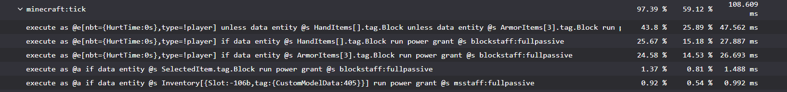

Modded Minecraft Usual Suspects
===============================

This is a list of usual suspects in case of modded Minecraft problems.
See also my [Modded Minecraft Crash Database](crash-database.html) for examples of crash reports and logs.
Also [superpowers04's Recommendations On What To Avoid](https://github.com/superpowers04/superpowers04/wiki/MC-Recommendations-On-What-To-Avoid) are a good resource

# Problems where the logs don't immediately point out the problem
- Game freezes when you open the creative inventory: libjf 3.17.4 has this issue. If you have that version of libjf, install 3.17.5 or newer from [modrinth](https://modrinth.com/mod/libjf/versions?g=1.21.1).

# Problems happening so often they deserver a mention here
- iris 1.8.12 is incompatible with new sodium versions. Use 1.8.14 instead. You might need to click something to show beta versions.
- tensura_ftb depends on ftb library, ftb teams, ftb chunks, and ftb quests, but does not declare it in a way for neoforge/fabric to show a nice message explaining this.
  If you are missing any one of them, you are going to get a crash on startup with a `NoClassDefFoundError`.
  I reports this [on their discord](https://discord.com/channels/831767201966456852/1550917435509448874) but have not gotten a response yet (as of 2026-09-30, 11 days after reporting it).
- tectonic depends on lithostitched but does not declare it in a way for neoforge to show a nice message explaining this.
  I just reported this [on their github](https://github.com/Apollounknowndev/tectonic/issues/534).

# Crashing/Incompatibilities

- Optifine (closed source, changes a lot of rendering related code, known for breaking mods)
- Lunar (obfuscated, changes a lot of stuff, known for breaking mods)
- Essential (collects Telemetry (once crashed while doing that), does LAN on modded which can break stuff)
- LabyMod
- anything popular with a bunch of add-ons, especially after a recent update
  - Create add-ons
  - Epic Fight add-ons
  - Relics compatibility/add-ons
  - cobblemon mega showdown

## (In)compatibility list for mods I deem important (based on how often I see them in logs)
- relics-1.21.1-0.12.8.jar (latest as of 2026-07-21, version from 2026-05-28):
  - Compatible
    - Aquaculture-1.21.1-2.7.21.jar
    - create-1.21.1-6.0.10.jar
    - reliquified\_artifacts-1.21.1-1.0.7.jar
  - Incompatible
    - rarcompat-1.21-0.9.7.jar (from 2025-08-12, working update available: reliquified\_artifacts-1.21.1-1.0.7.jar)
    - relicsofrain-0.3.1+1.21.1.jar (from 2025-08-13)

# Weird Bugs
Stuff you can't describe well, unreadable stack traces/logs, ...

- Essential
- MCreator mods (this also applies in cases of lags)
- any "clients"

# Slow Data Packs
Some functionality can be implemented via data packs.
This is not always a good idea, as seen in the data packs (sometimes packaged as mods) in this section.

## Entity NBT lookup
When a data pack tries to check what item a player/entity is holding, it has to do that via the `nbt` selector.
This causes the entire data of the entity to get serialized.
If this is done every tick, you get a slow and laggy world.
Especially if you have more crafting recipes, since the recipes a player unlocked in their recipe book are part of the players NBT data as well.

Data packs i know that do this are:

- any dynamic light data pack: to check if you are holding a torch or similar.
  Never use any kind of dynamic lights data pack.
  Use a client-side mod like [LambDynamicLights](https://modrinth.com/mod/lambdynamiclights) instead.
- Enchants Plus: it has a Luminosity enchantment. Same problem as dynamic light data packs above.
  Also Ice Aspect and Gluttony check nbt data, but they are not as bad as Luminosity.
- blockstaff (tested at v1.20.1): 

# Graphically Demanding Mods
If your game is lagging, try disabling graphically demanding mods first, since they are, well, graphically demanding.

- Distant horizons
- Bobby
- Iris/Oculus (or any other shader)

